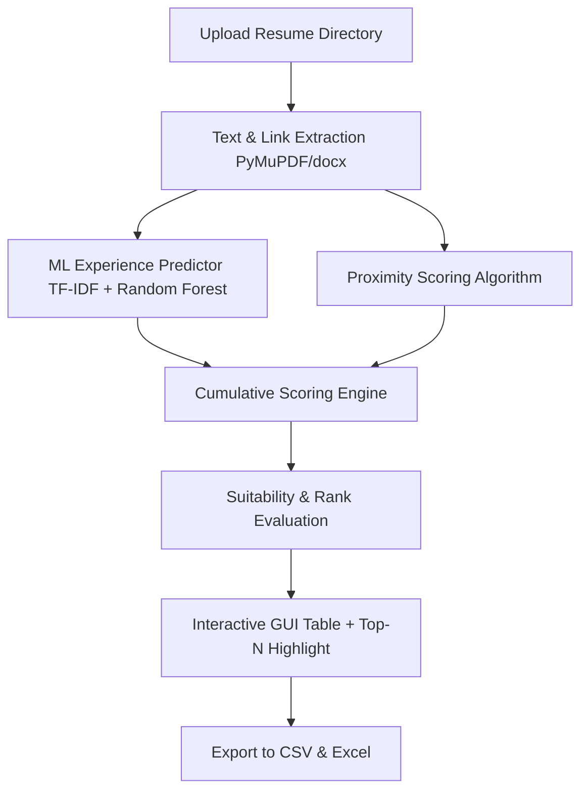

# 🚀 ML-Powered Resume Ranking & Parser using TF-IDF & Machine Learning

An intelligent, interactive resume screening and ranking desktop application that automates candidate matching. By combining **TF-IDF text representation**, a **Random Forest Regressor** for experience prediction, and a **Proximity-Based Scoring Algorithm**, it ranks candidates dynamically, grades their suitability, highlights top matches, and exports results directly into Excel and CSV.

---

## 🌟 Key Features

*   **Multi-Format Resume Parser**: Seamlessly extracts text from **PDF** (including extraction of LinkedIn and GitHub hyperlink URIs using `PyMuPDF`), **DOCX** (`python-docx`), and **TXT** files.
*   **Predictive Experience Estimation (ML)**: Trains an interactive **TF-IDF + Random Forest Regressor** model to predict a candidate's years of experience based on their resume text.
*   **Keyword Proximity Scoring**: Goes beyond simple keyword counts by scoring terms found in close proximity to industry-standard keywords (e.g., *python*, *java*, *developer*, *api*, *git*, etc.).
*   **Dynamic Suitability Grading**: Automatically categorizes candidates into premium suitability percentage bands based on proximity and total scores (ranging from 30% up to 100%).
*   **Smart Hiring Highlighting**: Input the number of open job roles, and the application instantly **highlights the top $N$ ranked candidates** in the interactive data table.
*   **Interactive Desktop GUI**: Built using Python's `tkinter` with a multi-column treeview. **Double-click** on a candidate's email, GitHub link, or LinkedIn profile to open it directly in your browser.
*   **Dual database export**: Automatically exports detailed candidate profiles, scores, predictions, and contact information to `resume_data_ml.csv` and `resume_data_ml.xlsx` upon processing.

---

## 🛠️ How It Works (The Math & Logic)



### 1. Predictive Experience Model
The machine learning pipeline vectorizes resume text using a **TF-IDF Vectorizer** to represent word importance. A **Random Forest Regressor** is then trained on labeled data to predict the years of experience.
*   **Vectorizer**: `TfidfVectorizer` (converts raw text to a matrix of TF-IDF features).
*   **Model**: `RandomForestRegressor(n_estimators=100)` (an ensemble of decision trees for robust regression).

### 2. Proximity Scoring Algorithm
Rather than performing a simple word count, the engine scans the text near the primary keyword. If context keywords (like *intern*, *developer*, *api*, *git*, *software*, etc.) are found within **2 words** of the target keyword, bonus points are added:

$$Score = (\text{Keyword Count} \times 1) + \text{Proximity Bonus}$$

### 3. Suitability Percentage Grading
Suitability is graded according to structured scoring criteria:
*   **Proximity Score > 100**: **100% Suitable**
*   **Total Score ≥ 75**: **90% Suitable** (High score category)
*   **Total Score ≥ 50**: **70% Suitable** (Medium score category)
*   **Total Score < 50**: **30% Suitable** (Low score category)

---

## 📁 Project Structure

```bash
r:\mini project\
├── main/
│   └── talentfarm_resume.py   # ⭐ Production-grade script with full features (Suitability %, Top-N highlight)
├── well.py                    # Legacy v1: Basic GUI + ML predictor
├── done.py                    # Legacy v2: Added proximity scoring & auto-sorting
├── newww.py                   # Legacy v3: Added "No. of Openings" and yellow highlighting
├── super.py                   # Legacy v4: Highlight configured to lightgreen
├── experience_model.pkl       # Labeled Random Forest Regressor binary
├── vectorizer.pkl             # TF-IDF Vectorizer binary
├── training_data.csv          # Training dataset of resumes and experience
├── resume_data_ml.csv         # Automatically exported processed data (CSV)
└── resume_data_ml.xlsx        # Automatically exported processed data (Excel)
```

---

## 📥 Installation

Follow these steps to set up and run the project locally on your machine.

### Prerequisites
*   **Python 3.8 or higher** installed on your system.
*   Tkinter package (comes pre-installed with standard Python distributions on Windows/macOS. For Linux/Ubuntu, install via `sudo apt install python3-tk`).

### Step 1: Clone or Navigate to the Workspace
Open your terminal/command prompt and navigate to the project directory:
```bash
cd "r:\mini project"
```

### Step 2: Set Up a Virtual Environment (Recommended)
Creating a virtual environment ensures dependencies do not conflict with other Python projects.

*   **On Windows:**
    ```bash
    python -m venv venv
    venv\Scripts\activate
    ```
*   **On macOS/Linux:**
    ```bash
    python3 -m venv venv
    source venv/bin/activate
    ```

### Step 3: Install Required Dependencies
Install the required packages using `pip`:
```bash
pip install pymupdf python-docx pandas joblib scikit-learn openpyxl
```

> [!NOTE]
> *   `pymupdf` is required for advanced PDF parsing and hyperlink extraction.
> *   `python-docx` is required for reading MS Word resumes.
> *   `scikit-learn` and `joblib` run the ML Vectorizer and Regressor models.
> *   `openpyxl` is required by Pandas to export database sheets directly to `.xlsx` format.

---

## 🚀 Running the Application

Always run the **master production-grade script** located in the `main` directory for the full suite of features (including suitability percentages and openings highlighting):

```bash
python main/talentfarm_resume.py
```

---

## 📖 How to Use

### 🏋️ 1. Training the Machine Learning Model (Optional)
If you want to train or fine-tune the experience prediction model with your own set of resumes:
1.  Click the **"Train Model"** button in the GUI.
2.  Select a folder containing a sample of resumes (`.pdf`, `.docx`, or `.txt`).
3.  The application will sequentially prompt you via dialog boxes to enter the known **years of experience** for each candidate.
4.  Once completed, the script saves `experience_model.pkl`, `vectorizer.pkl`, and logs all inputs in `training_data.csv`.

### 🔍 2. Screening & Ranking Resumes
1.  Enter your target keyword in the **"Enter Keyword:"** field (e.g., `Python` or `React`).
2.  Enter the number of available vacancies in the **"No. of Openings:"** field (e.g., `3`).
3.  Click the **"Select Resume Folder"** button.
4.  Choose the directory containing your candidate resumes.
5.  **Watch the magic happen!** The system will instantly extract the text, run ML experience predictions, calculate proximity scores, evaluate suitability bands, and sort all candidates descending by total score.
6.  The top candidates matching your number of openings will automatically be **highlighted in yellow** in the treeview.

### 🔗 3. Smart Link Navigation
*   Within the interactive table, you can **double-click** on a candidate's email, GitHub username, or LinkedIn profile to open the corresponding webpage/email handler immediately in your default browser.

### 💾 4. Auto-Generated Databases
Upon completion, the application auto-saves the full interactive screen results to:
*   `resume_data_ml.csv`
*   `resume_data_ml.xlsx`

---

## 🎨 Scoring Details Summary

| Column Metric | Description | Value Generation |
| :--- | :--- | :--- |
| **Rank** | Global ranking order of suitability | Ordered descending by Total Score |
| **File Name** | Original document filename | Extracted automatically |
| **Phone/Email** | Direct contact information | Extracted using Regex parsing |
| **LinkedIn/GitHub** | Hyperlinks attached inside PDF | Extracted using `PyMuPDF` URI parsing |
| **Keyword Count** | Frequency of your exact search term | Total count in text |
| **Proximity Score** | Context score | Earned by having target words near related context keywords |
| **Total Score** | Cumulative suitability metric | Sum of Keyword Count and Proximity Score |
| **Experience** | Predicted years of industry experience | Extrapolated from TF-IDF feature mapping through Random Forest Regressor |
| **Suitability %** | Dynamic percentage band | Evaluated based on total score milestones and proximity |

---

> [!TIP]
> Make sure to include some mock resumes with rich formatting, hyperlink anchors (like your own LinkedIn page), and text descriptions to see the parser and highlight tools demonstrate their full capability!
